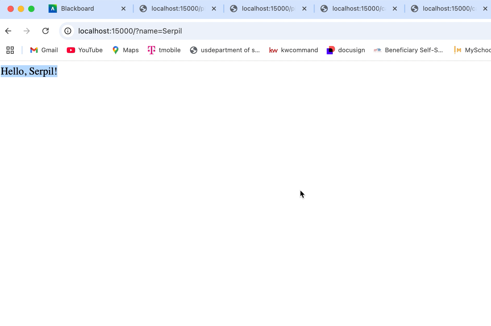
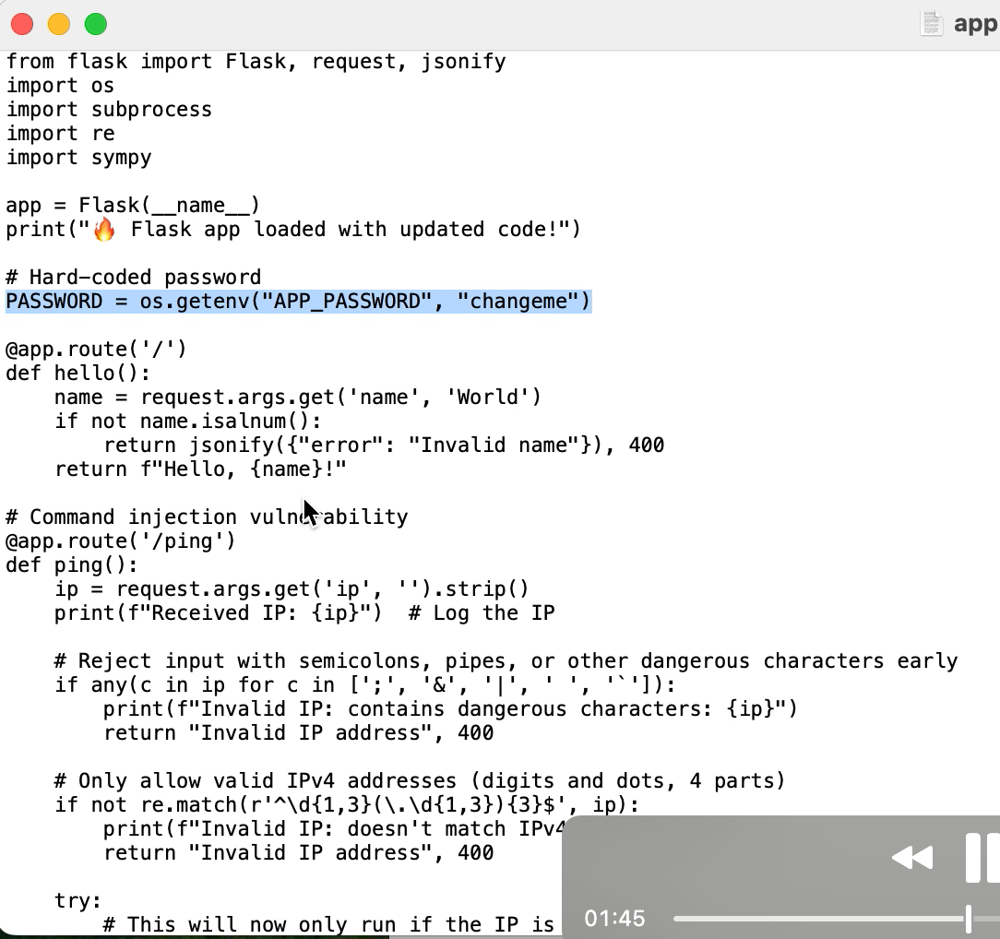
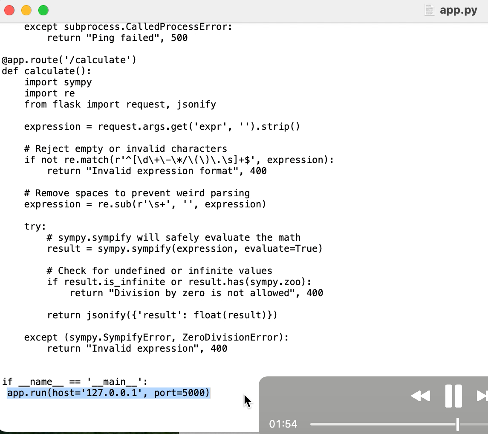
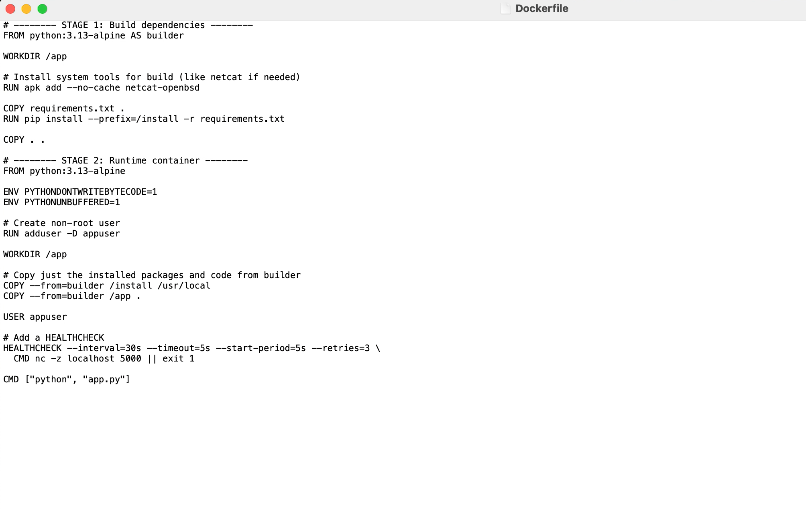
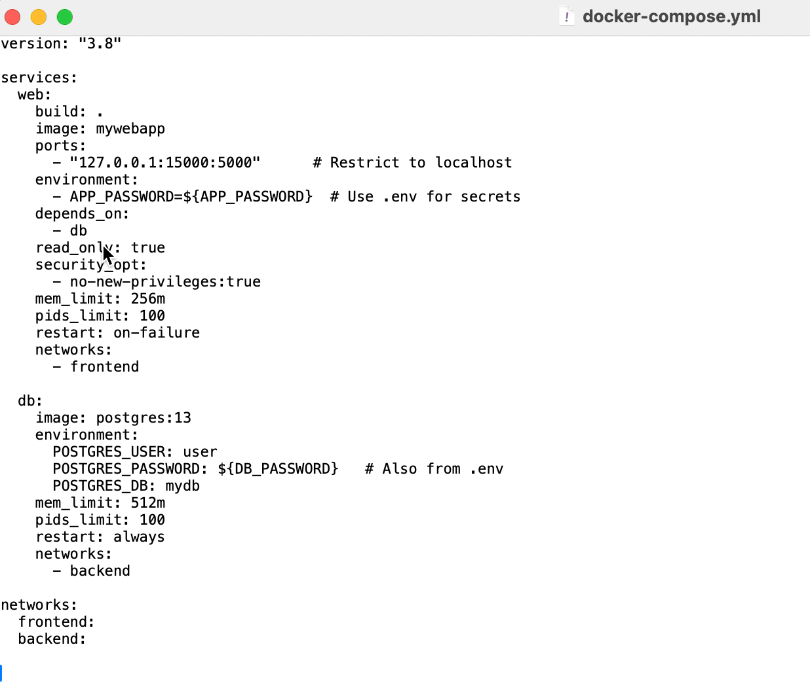
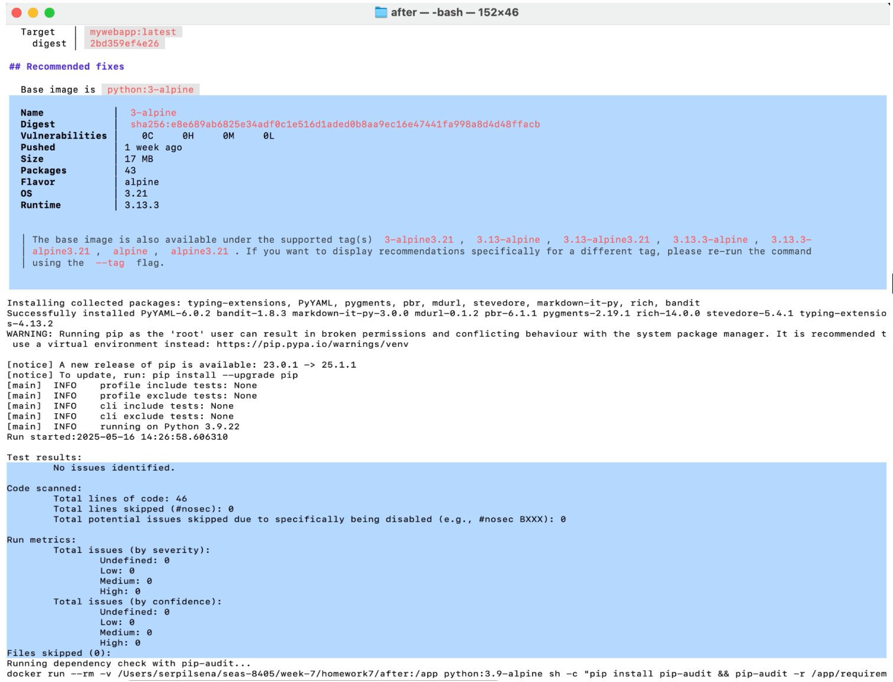

# Summary Report – SEAS-8405 Homework 7
## Security Hardening of a Containerized Flask Application  
*Serpil Rivas*  
*Date: May 16, 2025*
>### Introduction

This report documents the process and outcomes of hardening a vulnerable containerized Python Flask application as part of Homework 7 for SEAS-8405 Cybersecurity Architecture. The purpose of this exercise was to identify real-world security issues within a microservices-based web application and implement defenses that align with best practices and security architecture frameworks, including Defense in Depth (DiD), Zero Trust Architecture (ZTA), and Adaptive Security Architecture (ASA).

This activity included the use of open-source security tools, container hardening, vulnerability scanning, and architecture design. All mitigation approaches were deployed in a layered and contextualized manner, designed to reduce the attack surface, apply least privilege, and strengthen system resilience. This report includes a thorough explanation of tools used, vulnerabilities discovered, remediations applied, architectural improvements, and key lessons learned.

>### Tools and Definitions

- **Docker & Docker Compose**  
  Docker is a platform for containerizing applications, providing lightweight isolated environments for code execution. Docker Compose is a tool for defining and managing multi-container applications.  
  *[Docker, 2024]*

- **Bandit**  
  Bandit is a Python static analysis tool designed to find security issues in Python code. It scans for known vulnerabilities such as hardcoded passwords, unsafe `eval()` calls, and weak input validation.  
  *[Bandit, 2024]*

- **ast.literal_eval**  
  A safe alternative to `eval()` for parsing Python literals. It prevents remote code execution.  
  *[Python Docs, 2024]*

- **OWASP Top 10**  
  An industry-standard list of the ten most critical web application security risks.  
  *[OWASP, 2021]*

- **Draw.io (diagrams.net)**  
  A free online diagram tool used to create the architecture diagram for this report.  
  *[Diagrams.net, 2024]*

>### Steps Taken

1. **Deployed the vulnerable Flask app using Docker Compose.**  
   The application was launched using `docker-compose up -d`, and containers started successfully.  
   The Flask app responded as expected at `localhost:15000`.

     
   

2. **Scanned the codebase using Bandit for known vulnerabilities.**  
   The Bandit static analysis tool identified unsafe subprocess calls, use of `eval()`, and insecure host bindings.  

   

3. **Fixed hardcoded credentials, unsafe `eval()`, and missing input validations.**  
   Environment variables replaced hardcoded secrets, `eval()` was replaced with safe math evaluation, and input validation was enforced using regex and type checks. 

     

   

4. **Hardened the Dockerfile by using a minimal base image, creating a non-root user, and adding a HEALTHCHECK.**  
   The updated Dockerfile uses `python:3.13-alpine`, adds a non-root user, and includes a container health check. 

   

5. **Updated `docker-compose.yml` with resource limits, read-only filesystem, and localhost port binding.**  
   Memory, process, and network restrictions were added to limit the blast radius of any compromise. Sensitive credentials were sourced securely from `.env` files. 

   

6. **Created a secure architecture diagram using draw.io.**  
   The architecture diagram was designed using [https://app.diagrams.net](https://app.diagrams.net) to visually represent security controls across the microservices deployment.  
   It highlights container roles, Docker runtime protections, and network boundaries for defense-in-depth.  

   

>### Threat Modeling and Security Alignment

In order to ensure the Flask-based microservices application was resilient against common container threats, a structured threat modeling process was conducted using the STRIDE framework. Each threat category, Spoofing, Tampering, Repudiation, Information Disclosure, Denial of Service, and Elevation of Privilege, was mapped to specific application behaviors and mitigated accordingly through code or container-level controls.

The model was extended with MITRE ATT&CK for Containers to identify real-world adversarial behaviors, such as container breakout attempts (T1611), user execution attacks (T1204), and implanting malicious images (T1525). Corresponding defenses were implemented using secure base images, read-only containers, strict input validation, and least privilege enforcement.

In addition, each discovered vulnerability was mapped to relevant NIST 800-53 controls to validate the remediation against industry standards. Examples include:
- **AC-6 / IA-5**: Enforced least privilege and proper credential handling  
- **SI-10 / SC-39**: Input validation to block command/code injection  
- **SC-12 / SC-28**: Protecting sensitive data at rest and in transit

The secure architecture diagram shown above (under steps taken, 6) visually reinforces this model by outlining privilege boundaries, container roles, and Docker hardening techniques such as `userns-remap`, `read_only`, `mem_limit`, and `no-new-privileges`.  

>### Validation and Vulnerability Comparison

To confirm that the remediation efforts were effective, a set of before-and-after vulnerability scans were performed.

Docker Scout scans initially identified multiple vulnerabilities in the base image (`python:3.9-alpine`) and flagged insecure configurations. After refactoring the Dockerfile, switching to `python:3.13-alpine`, and locking down permissions and secrets, the image was rescanned.

The final scan returned **zero vulnerabilities**, confirming that hardening was successful and aligned with best practices for secure container development.

**Before Hardening: Vulnerabilities Present**  

**After Hardening: No Vulnerabilities Detected**  

>### Architecture Improvements

**Before:** Flat architecture, root containers, no runtime checks.  
**After:** Layered defenses, non-root containers, hardened deployment.  
Mitigations applied addressed OWASP A1, A3, A5, and A7 vulnerabilities.  
*(OWASP, 2021)*

>### Lessons Learned

- Multi-layered defense is essential.  
- Static analysis is valuable for identifying hidden issues.  
- Small misconfigurations can have large impacts.  
- Automation must be combined with manual review.

>### Mitigations and Their Purpose

| Mitigation           | Purpose                                  |
|----------------------|------------------------------------------|
| ast.literal_eval()   | Prevents remote code execution via input |
| Non-root user        | Reduces privilege escalation risk        |
| .env secrets         | Avoids exposing hardcoded credentials    |
| HEALTHCHECK          | Enables service health monitoring        |
| Read-only filesystem | Prevents tampering with container        |
| Localhost binding    | Restricts external network exposure      |

>### Challenges and Resolutions

| Problem                  | Fix                                       |
|--------------------------|-------------------------------------------|
| Container not starting   | Fixed indentation in `docker-compose.yml` |
| App failing input validation | Tuned regex and input checks         |
| False Bandit positives   | Reviewed and suppressed expected results  |
| Secrets formatting       | Ensured `.env` did not contain extra whitespace |

>### Reflection and Framework Alignment

This hardening exercise directly reflects Secure Software Development Lifecycle (SSDLC) principles, emphasizing secure design, static analysis, and verification steps integrated throughout the containerization workflow. Also, the multi-layered defenses deployed, input validation, non-root execution, and networking restriction—are aligned with core principles of Defense in Depth (DiD) and Zero Trust Architecture (ZTA), enforcing least privilege and limiting trust boundaries.

>### Conclusion

This assignment provided in-depth, hands-on experience with applying modern container security techniques across the entire application lifecycle. By identifying vulnerabilities, implementing layered defenses, and validating remediations through automated tools and architecture design, it was possible to transform an insecure microservices deployment into a hardened, production-ready environment.

The final application now demonstrates improved resistance to code injection, privilege escalation, and remote exploitation. Security principles such as least privilege, network isolation, and input validation were enforced through both code and infrastructure-level controls. These changes not only addressed common OWASP Top 10 categories but also aligned with NIST 800-53 security controls and MITRE ATT&CK techniques relevant to containerized environments. This project also highlighted the importance of integrating security early in the development process, an essential component of secure DevSecOps pipelines. Writing an auto-hardening script emphasized the value of automation, but also the necessity of manual review and threat modeling to catch risks that scanners alone might miss.

Overall, the assignment strengthened my understanding of secure software development lifecycle (SSDLC) principles, Defense in Depth (DiD), and Zero Trust Architecture (ZTA). These experiences will directly support my ability to design, assess, and secure real-world containerized systems in both academic and industry environments.

>### References

- OWASP Foundation. OWASP Top 10 - 2021. https://owasp.org/www-project-top-ten/  
- Docker Documentation. https://docs.docker.com/  
- Python Bandit Tool. https://bandit.readthedocs.io/  
- Diagrams Library. https://diagrams.mingrammer.com/  
- NIST 800-53 Controls. https://nvd.nist.gov/800-53  
- Python Documentation on ast.literal_eval. https://docs.python.org/3/library/ast.html#ast.literal_eval

